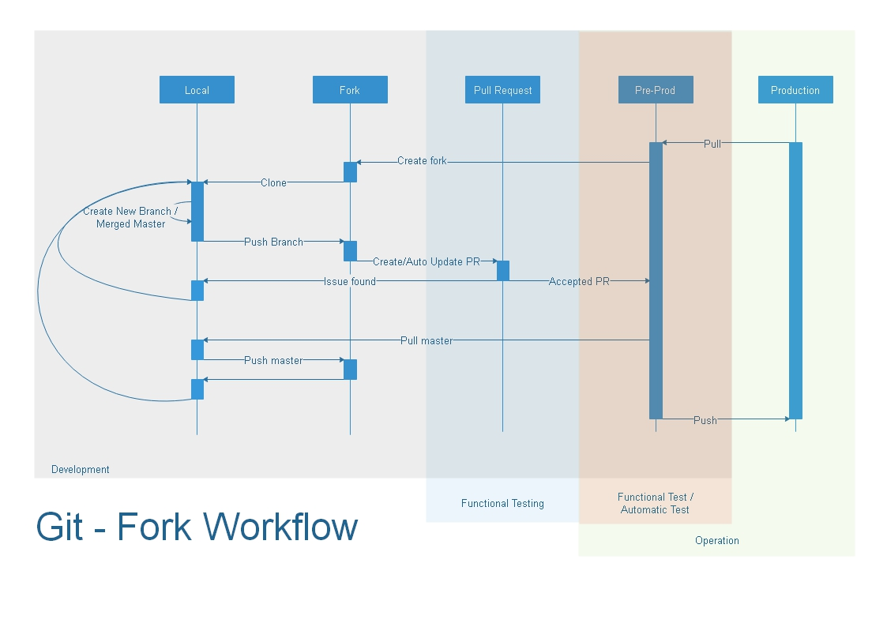

## Git - Fork Workflow

#### Development Scope

###### Preparing local repository

1. Create a fork from production/pre-prod repository.

2. Create a clone of your fork to your local.

3. To start a new implementation, create a new working branch from master.

4. Complete the implementation 

5. Push to your fork.

6. Create a pull request from your fork. 

   6.1. Request a code review.

###### Working on issue found by testing
1. Merge the master to your working branch.

2. Complete the refinement 

3. Push to your fork *(i.e. this will automatically update the pull request.)*

4. Notify the tester about the updated pull request.

   4.1. Request a code review if the refinement is significant.

###### Accepted pull request

1. On your local master branch, pull the master branch from production/pre-prod repository.

2. Push the update from your master branch to your fork.

3. Create a new working branch to start a new implementation.

4. Complete the implementation.

5. Push to your fork.

6. Create a pull request from your fork. 

   6.1. Request a code review.

###### First thing in the morning (Recommended)

> It is advisable to be always not that far from production/pre-prod repository.

1. On your local master branch, pull the master branch from production/pre-prod repository.
2. Push the update from your master branch to your fork.
3. Merged the updated master to your working branch.

#### Testing Scope

###### Testing the completed pull request

1. Identify the pull request.

2. Load the pull request to testing environment.

3. If an issue was found, send back to the developer for further refinement.

   3.1. Wait for the pull request update.

4. If everything was good, merge the pull request to production/pre-prod repository.

###### Testing the merged pull request to production/pre-prod repository

1. Redo testing made from *testing the completed pull request*.
2. Run automatic testing.

#### Operation Scope

**Pre-Prod** and **Production** repositories can just be one or separate. Make them separate if you are not comfortable running automatic testing in production repository as long they are mirroring each other.

1. Deploy a package done only from the production repository.

-------

The image was created from **Edraw Max 9.4**